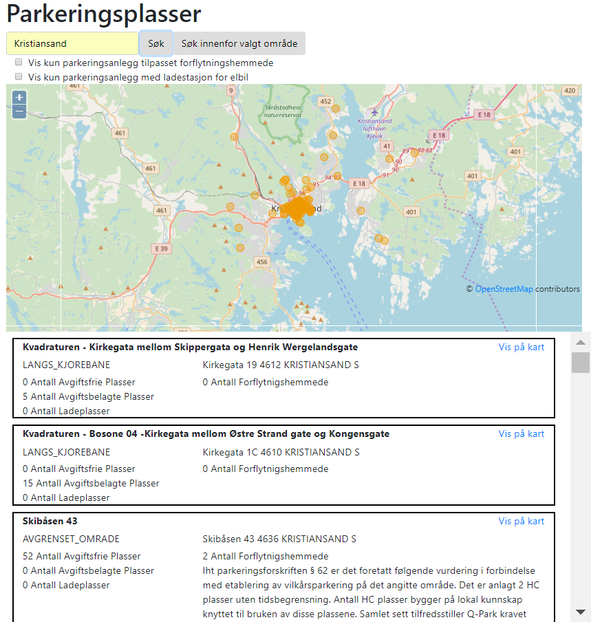

<h1>Obligatorisk Innlevering 4 
11. mai 2018</h1>
<h2>Gruppe MCV  
Maria Gina Nessler, Caroline Andersen, Veronika Andersen</h2>

<h2>Spesifikasjon</h2>

Vi har lagd en oversikt over alle parkeringsplasser i Norge. Oversikten
viser navn, type parkeringsplass, adresse, antall avgiftsfrie plasser,
antall avgiftsbelagte plasser, antall ladeplasser, antall parkeringsplasser
for forflytningshemmede, og informasjon for forflytningshemmede.

Man kan søke, enten på poststed eller navn på parkeringsplassen, og
resultat vises både som markører på kart, og i en liste med all
informasjon.

Resultatlisten har også link til kartet, slik at kartet sentreres på
koordinatene til valgt parkeringsplass når man trykker på linken.
Trykker man på en parkeringsplass på kartet, scrolles resultatlista
til riktig sted, og highlighter den valgte parkeringsplassen.

Vi har også en søkefunksjon som søker basert på området som vises på
kartet. Vi tar utgangspunkt i koordinatene midt på kartet, og søker i
en radius på 10 km. Resultatlista under vil da sorteres på avstand
(i luftlinje) fra senter av kartet.
Søket inneholder også to filter: «Vis kun parkeringsanlegg tilpasset
forflytningshemmede», og «Vis kun parkeringsanlegg med ladestasjon for
elbil». Dette for at man enkelt skal kunne finne parkering tilpasset
spesielle behov.

Søket er begrenset til 150 treff.

##Arkitektur
#####Kart
Vi har brukt Open Street Map til å presentere søkeresultatene fra APIet 
på et kart. Når man trykker søk, hentes koordinatene fra lista med treff, 
og disse plottes inn på kartet ved hjelp av funksjoner fra Open Street 
Maps javascriptsbibliotek «OpenLayers».

#####Søk
Webserveren eksponerer to APIer som returnerer json. Disse brukes fra 
javascriptet til å kjøre søkefunksjonene.
Søket sender en get-forespøsel til webserveren med søkeparameter 
(poststed/navn, filtervalg, og eventuelle koordinater fra nettleseren), 
og får tilbake json-resultat fra overnevnte API, som plottes inn i kart 
og resultatliste.  
Hele databasen hentes fra Vegvesenet, og filtrerer basert på søkeparameter. 
Ved lokasjonssøk (hentet fra nettleseren) filtreres og sorteres søket også 
på avstand, slik at nærmeste parkeringsplass kommer øverst. Her har vi 
funnet en algoritme som regner ut avstand mellom koordinater.

#####Layout
Vi har brukt Bootstrap som CSS-rammeverk, dette for å ta i bruk 
Bootstrap’s grid-system til å lage rader og kolonner. 

